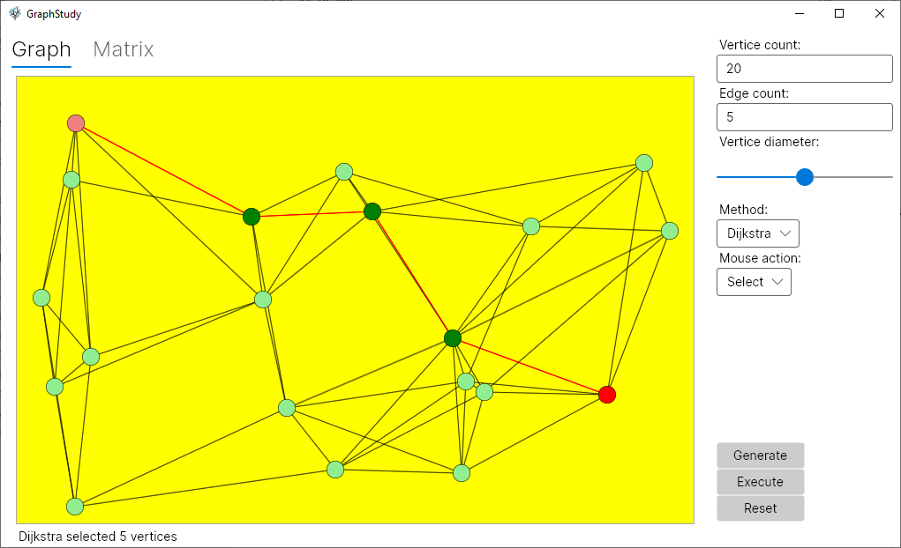

# GraphStudy
Test project to study Avalonia UI and graph algorithms. 

## Basics
The application builds a graph consisting of specified number of vertices (nodes) and adds connecting edges between them. The vertices and edges can be selected and two vertices can be marked as start and end node. 

There are two algorithms that can be applied to the graph - Dijkstra shortest path search and random walk. More algorithms can be easily added.

When only start node is selected, the Dijkstra algorithm highlights shortest path three. When no start node is selected, random start node gets chosen automatically. 

There is no serialization, the application state is lost on exit.

## Build
The build was tested using VS Code on Mac and Windows, and Visual Studio 2022 on Windows. It will probably also work fine in Rider. The .NET 5.0 runtime must be installed.

## Usage
Start the program and:

- Click 'Generate' button to populate the canvas with random graph. 
- Select start and end node for path traversal. 
- Click 'Execute' to run algorithm to find path from start to end.
- Click 'Reset' to clear the selection.

## Preview

